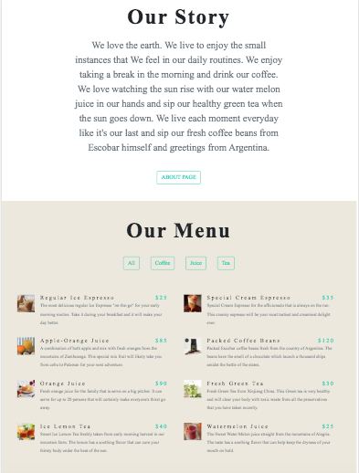
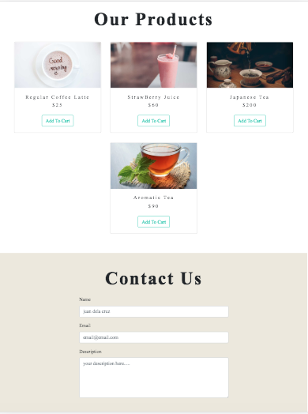
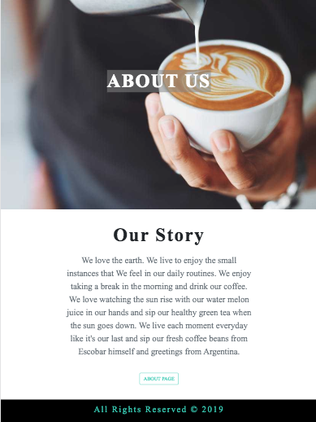

## This is an E-commerce Coffee Shop built on the following technologies:

## App Screenshots

live site: https://annalous-coffeeshop.netlify.com/

- Gatsby framework
- Uses Contentful CMS to store all the product data
- Uses Snipcart to process automatic payment fields when making purchases
- Uses Disqus to get engagement
- Uses formspree.io for auto mailing submissions
- Can create a blog using markdown

Initial Commit:

- Completed e-commerce set up

To run the app,

- npm start or gatsby develop on CLI
